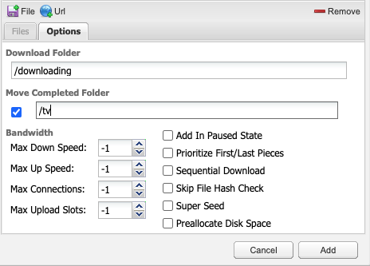

# Local Media Server Stack

This is a Docker Compose setup for running a local media server.  It includes the following:

- [Jellyfin](https://jellyfin.org/) - Media server
- [Deluge](https://deluge-torrent.org/) - Torrent client
- [OpenVPN](https://openvpn.net/) - VPN client

## Pre-requisites
The following are required to run this stack:

- [Docker](https://docs.docker.com/get-docker/)
- [Docker Compose](https://docs.docker.com/compose/install/)

## Setting up the VPN
The VPN client requires an OpenVPN configuration file (your VPN provider should be able to give you this).  This file should be placed in the `volumes/openvpn` directory and named `server.ovpn`.  The VPN client will automatically connect to the VPN server when the stack is started.

### Automatic VPN Login
If your VPN requires a username and password to login, add a `volumes/openvpn/login.conf` file containing the username and password on separate lines.
```
username
password
```

Then find the line in the `server.ovpn` file that says `auth-user-pass` and add the login file after it.  It should look like this:
```
auth-user-pass login.conf
```

## Starting the stack
To start the stack, run the following command:
```
docker-compose up -d
```

## Setting Up Deluge
Deluge is configured to use a VPN connection.  To connect to Deluge, go to `http://localhost:8112`. The default password is `deluge`, but you can change this in the Preferences.

## Setting Up Jellyfin
To connect to Jellyfin, go to `http://localhost:8096`.  The default username is `admin` and the default password is `jellyfin`. 

Jellyfin is configured already with a "Movies" library that points to the `volumes/jellyfin/movies` directory, and a "Shows" library that points to `volumes/jellyfin/tv`.


## Stopping the stack
To stop the stack, run the following command:
```
docker-compose down
```

## Adding a new torrent
To add a new torrent, go to `http://localhost:8112` and add the torrent to Deluge. Torrents will automatically be downloaded to the `volumes/deluge/downloading` directory until they are completed, when they are moved to a Jellyfin library. The default library is `Movies`, but you can change this to `tv` when adding the torrent.



